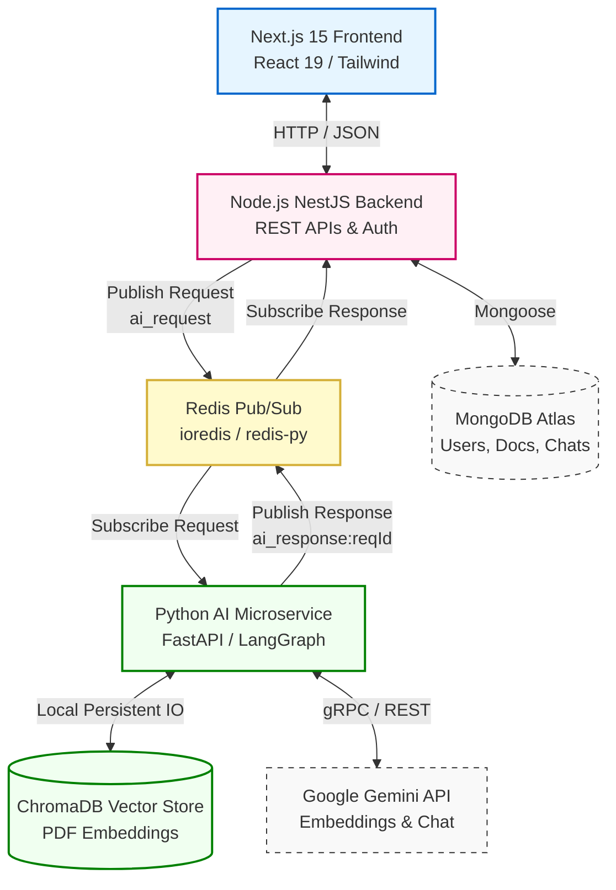
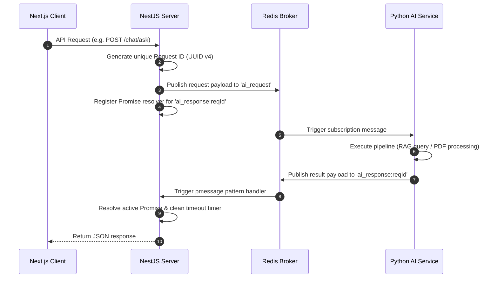

# System Architecture Diagram & Description

This document provides the high-level system architecture and interaction flow for the AI PDF Knowledge Base Chatbot system.

---

## 🗺️ Architectural Diagram

The diagram below details the physical layout, interfaces, and databases mapping each service component.

---

## 🔁 Request-Reply Communication Flow

The backend communicates with the Python service through **Redis Pub/Sub** using an asynchronous request-response cycle:

---

## 🧩 Architectural Design Rationale

1. **Decoupled Architecture**: 
   Direct HTTP connections between the API server and the AI server are avoided. Using Redis Pub/Sub prevents requests from backing up, isolates server crashes, and makes it easy to add more AI worker instances when traffic increases.
2. **Double-Extraction PDF Strategy**:
   The AI service tries using `pypdf` first because it is 10x faster. If the text returns empty (common with scanned documents or tables), it falls back to `pdfplumber` to extract high-fidelity text.
3. **Matryoshka Embeddings**:
   The system uses the modern `models/gemini-embedding-001` model to generate 3072-dimensional semantic embeddings. The higher dimensionality provides superior search accuracy compared to legacy 768-dimensional models.
4. **Stateful Graph Orchestration**:
   Rather than chaining prompts sequentially, the chat pipeline is implemented as a stateful graph in **LangGraph**. This guarantees strict path transitions, reliable error-handling states, and clean separation between context retrieval, answering, and suggestion generation.
